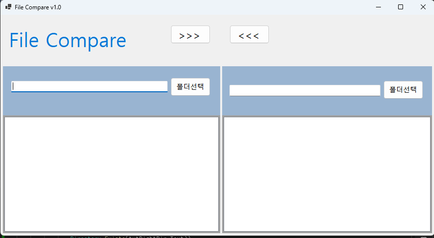
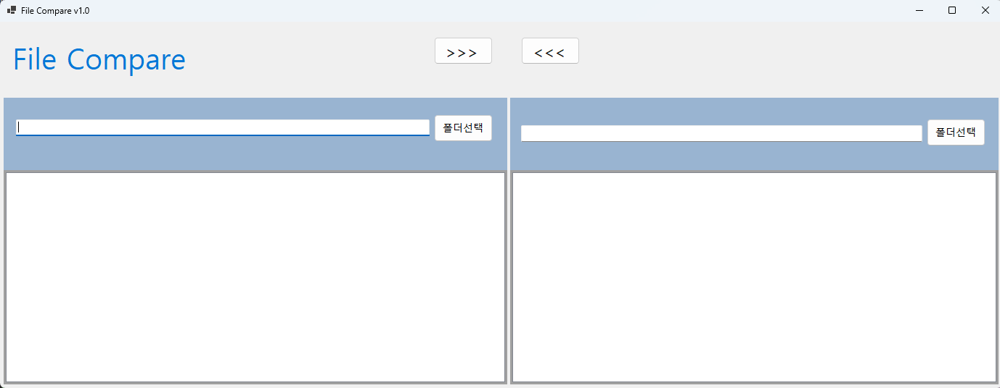
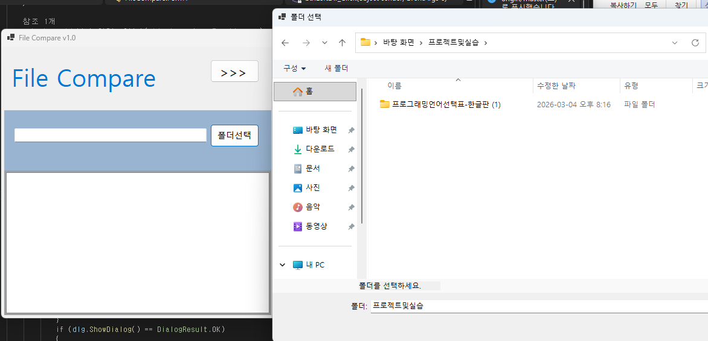
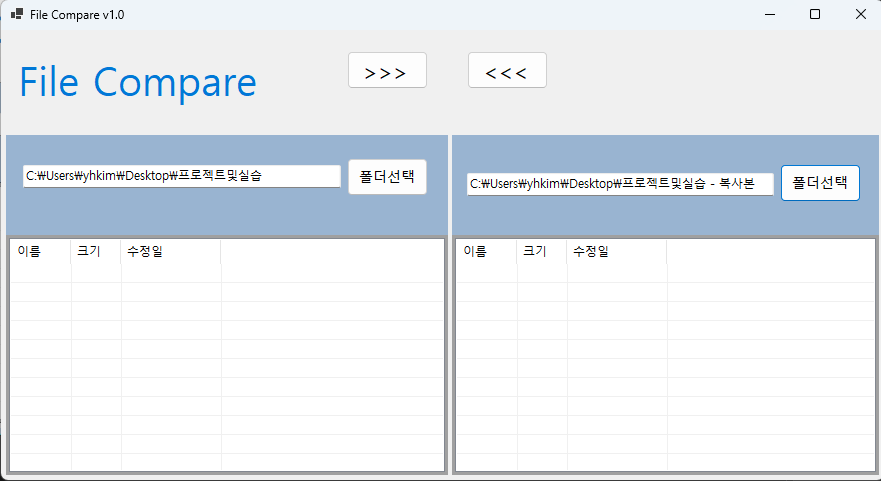
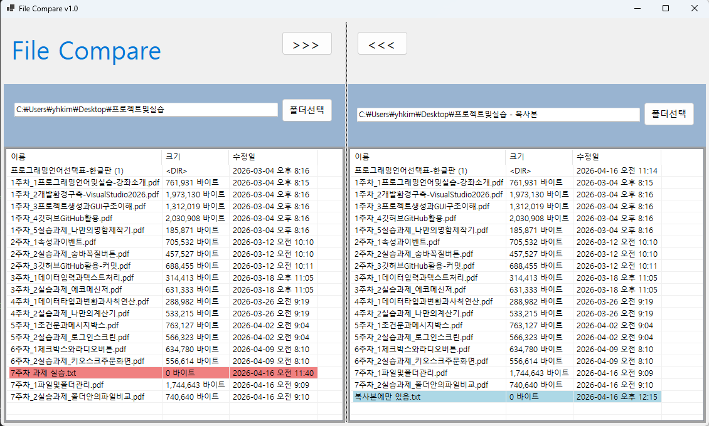
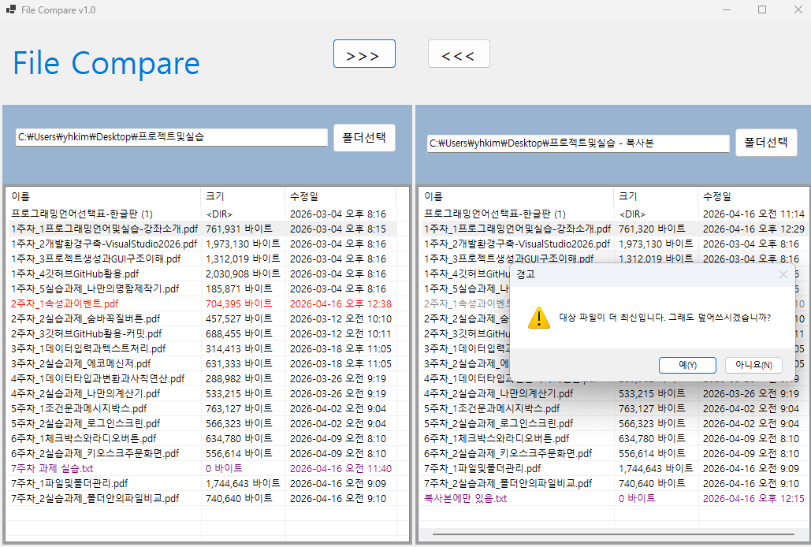
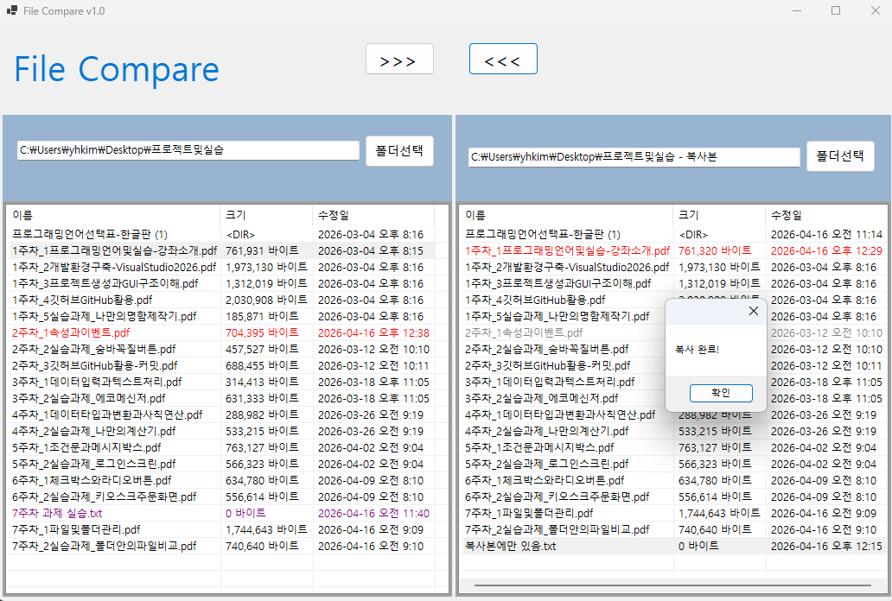
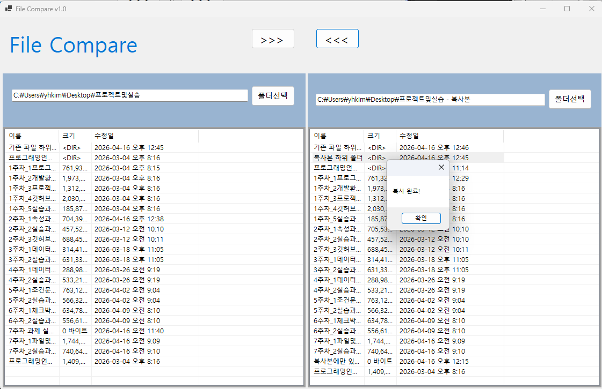

# (C# 코딩) 파일 비교툴
## 개요
- C# 프로그래밍 학습
- 1줄 소개: 두 폴더의 파일들을 비교해서 상호 복사하는 툴을 만들기 
- 핵심기능: UI 구성에 사용한 다양한 컨트롤과 FolderBrowserDialog와 같은 클래스 사용을 통한 파일 복사 프로그램
- 화면구성: Label, Textbox, Button, SplitContainer, ListView, Panel
- 사용한 플랫폼: 
	- C#, .NET Windows Forms, Visual Studio, GitHub
- 사용한 컨트롤:
	- Label, TextBox, Button, SplitContainer, ListView
- 사용한 기술과 구현한 기능:
	- Visual Studio를 이용하여 UI 디자인
	- ListView 컨트롤을 이용한 파일 목록 표시 기능 구현
	- SplitContainer를 이용하여 화면 분할 기능 구현
	- FolderBrowserDialog 클래스를 사용한 윈도우 파일 브라우저 사용
	- enum을 이용한 파일 상태 구분

## 실행 화면 (과제1)
- 코드의 실행 스크린샷과 구현 내용 설명

- 구현한 내용(위 그림 참조)
	- UI 구성을 위한 GUI 설계 및 컨트롤 배치
	- 컨트롤에서 기본적으로 제공하는 기능 구현
	- 각 컨트롤의 Anchor 속성을 이용한 UX 기능 구현 완료

## 실행 화면 (과제2)
- 코드의 실행 스크린샷과 구현 내용 설명

- 구현한 내용(위 그림 참조)
	- FolderBrowserDialog 사용하여 폴더 선택 기능 구현
	- ListView 컨트롤을 이용하여 선택한 폴더의 파일 목록 표시 기능 구현
	- 색상 구분을 통한 최근에 수정된 파일과 오래된 파일 구분 표시 기능 구현

## 실행 화면 (과제3)
- 코드의 실행 스크린샷과 구현 내용 설명

- 구현한 내용(위 그림 참조)
	- 양쪽 폴더 사이에서 파일의 복사 기능 구현
	- 선택한 파일을 반대쪽 폴더로 복사하는 기능 구현
	- 복사 버튼을 누르면 파일의 수정 날짜를 확인하여 최신 파일이 복사되도록 구현

## 실행 화면 (과제4)
- 코드의 실행 스크린샷과 구현 내용 설명

- 구현한 내용(위 그림 참조)
	- 파일 복사 뿐만 아니라 폴더 복사 기능 구현
	- 폴더에 대해서도 파일과 동일하게 색 구분을 통해 다른 파일에 없는 폴더를 표시
	- 복사 버튼을 누르면 하위 폴더의 모든 내용 처리